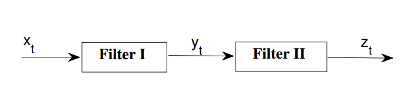
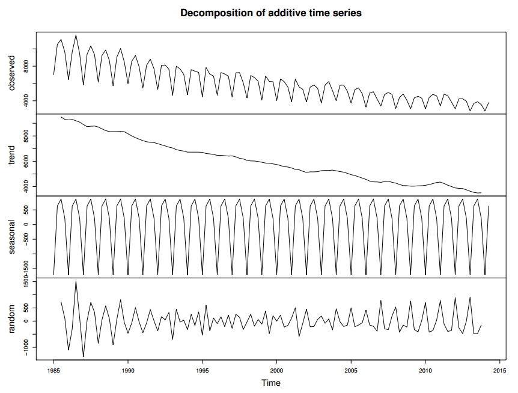
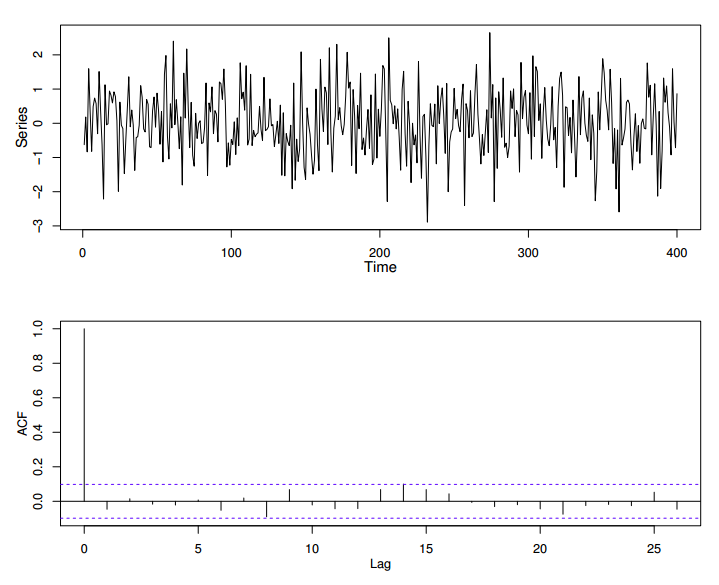
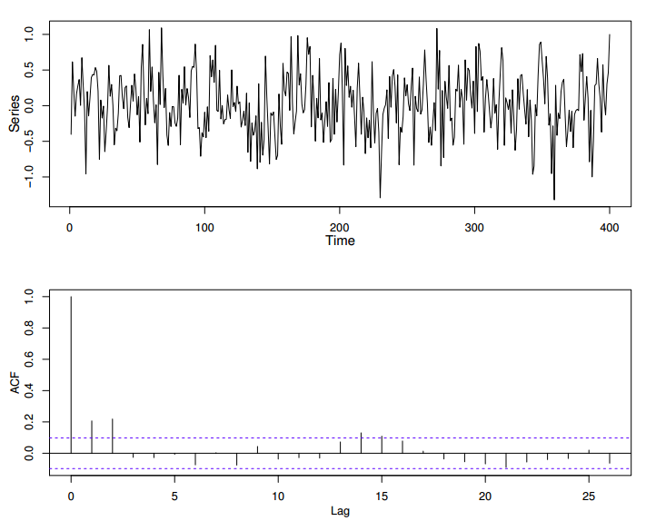
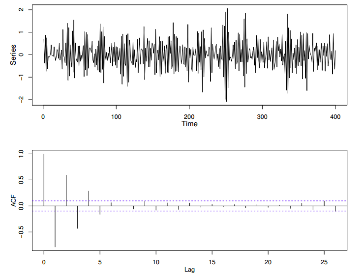
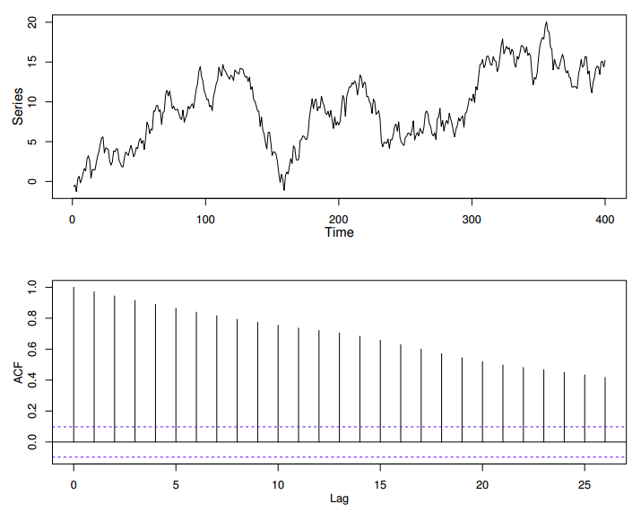

# Study Notes of Time Series

## Part 1: Basic Descriptive Techniques

### 1.1 $~$ Types of Variations

*Seasonal Variations*

- annual in period

- e.g. sales figure, temperature reading

- can readily be estimated if directly interested

- can be removed from the data if not directly interested

*Other Cyclic Variations*

- variatons at fixed period $~~~$ e.g. daily temperature

- variation not at fixed period, but still predictable $~~~$ e.g. business cycles of 3 to 4 years or more than 10 years

*Trend*

- 'long term change in the mean level'

- need to take into account the number of observation available and make a subjective assessment of what 'long term'  means

- e.g. climate variables: data of 50 years we may see a cyclic variation; while data of 20 years we may only see a trend

*Other irregular fluctuation (Residual)*

- after trends and cyclic variations are removed from the data, we will observe the residual that may or may not be 'random'

- need to analyze if there is any cyclic variation left to be extract, or

- any irregular variations may be explained in terms of probablity models, such as moving average (MA) or autoregressive (AR)

### 1.2 $~$ Stationary Time Series

**Stationary:** A time series is stationary if there is no systematic change in mean (no trend, if there is no systematic change in variance and if stricly periodic variations has been removed.

- Many theories are concerned with stationary time series. So **transform** to statsionary if neccessary.

### 1.3 $~$ Transformations

####*1. To stablize the variance*

Suggested if: (1) there is a trend; (2) variance is increasing with the mean

- If the standard deviation is directly proportional to the mean, **a logarithm transform is indicated**.

- If the variance changes through time without a trend being present, then a transformation will not help. In such cases, a model that allows for changing variance should be considered.

####*2. To make the seasonal effect additive*

Suggested if: (1) there is a trend; (2) seasonal effect is increasing with mean

- if so, suggested to make the seasonal effect constant from year to year. This is refer to as **additive seasonal effect**.

- **Multiplicative seasonal effect** if directly proportional to the mean.

- A **logarithm transformation** is suggested to make it additive

- However, this transform will only stablize the variance if error term is also thought to be multiplicative (see later)

####*3. To make the data normally distributed*

- Model building and forecasting are usually carried out on the assumption
that the data are normally distributed.

- Difficult. Necessary to model the data using a different 'error' distribution

**BOX-COX transformation**:

logarithm and square-root are special cases of BOX-COX. Given a time series $\{x_t\}$ and a transformation parameter $\lambda$, the transformed series is given by:

\[
   y_t= \begin{cases}
        (x_t^\lambda-1)/\lambda, & \text{if}\ \lambda \neq 0\\
        log \ x_t, & \text{if}\ \lambda = 0 \end{cases}
\]

**Problems in practice:**

1. Experiments found little in improvement with BOX-COX transformation

2. Cannot achieve all of the above requirements

3. Hard to 'transform back'

### 1.4 $~$ Analyzing Series WITH Trend and NO Seasonal Variations

Simplest type of trend, 'linear model + noise': an observaton at time $t$ is a random variable $X_t$

\[
X_t = \alpha + \beta \ t + \epsilon \tag{1.1}
\]

- (1.1) is a deterministic function of time and is sometimes called **global** linear trend, and is generally not practical.

- More emphasis on models that is **locally** linear. One possibility is to fit a **piecewise linear** model.

- To solve the unsmoothing points in pieceise linear model, we could assume that $\alpha$ and $\beta$ evolve stochastically, leading to a **Stochastic Trend**.

**General Approaches:**

#### *1.4.1 $~$ Curve fitting*

-  ** for future updates **

#### *1.4.2 $~$ Filtering*

**Moving Average**

Basic Formula:

\[
y_t = \sum^{+s}_{r = -q} a_r x_{t+r} \\
s.t.  \sum a_r = 1
\]

- Simplest example: $Sm(x) = \frac{1}{2q+1}\sum_{r = -q}^{q} x_{t+r} $. Help to removing seasonal variation.
- **Symmetric coefficient**: $(\frac{1}{2} + \frac{1}{2})^{2q}$. When q gets large, approximates to normal curve.

- **Spenser's 15-point** moving average: used for mortality stats

- **Henderson** moving average: cubic polynomial trend without distortion.

**end-effects problem**: happens when symmetric filter is chosen. $Sm(x)$ can only calculate from $ t=q+1$ to $t = N-q$. In forecasting, it is particularly important to calculate smooth values up to $t=N$.

- **Exponential Smoothing**:
$$Sm(x) = \sum^\infty_{j=0} \alpha(1-\alpha)^j \  x_{t-j} $$

  where $0 < \alpha < 1$. Note that $\alpha(1-\alpha)^j$ decreases geometrically with j.

Once we have extimated the trend, we calculate the residual:

\[ \begin{aligned}
  Res(x_t) &= \text{residual from smmothed value} \\
   &= x_t - Sm(x_t) \\
  &= \sum^{s}_{r=-q} b_r \ x_{t+r}
\end{aligned}\]

- This is also a linear filter with $b_0 = 1 - a_0$ and $b_r = -a_r$ for $r\neq0$.
- If $\sum a_r = 1$ then $\sum b_r = 0$

##### *Filter in Series*

A smoothing procedure can be carried out in two or more stages.

It is easy to show that a series of linear operations is still a linear filter:

Suppose filter 1, with weights $\{a_r\}$, acts on $\{x_t\}$ to produce $\{y_t\}$ Then filter 2 with weights  $\{b_r\}$ acts on  $\{y_t\}$ to produce  $\{z_t\}$. Now,

\[ \begin{aligned}
z_t &= \sum_j b_j \ y_{t+j} \\
    &= \sum_j b_j \ \sum_r a_r \ x_{t+j+r} \\
    &= \sum_k c_k \ x_{t+k}
\end{aligned}\]

where $$ c_k = \sum_r a_r \ b_{k-r} $$

Note that $c_k$ is obtained by **convolution**.

#### *1.4.3 $~$ Differencing*

- A special type of filtering, particularly useful for removing a trend.

- For non-seasonal time series, first order is usually sufficient to obtain stationary series.

For a given time series $\{x_t\}, t \in [N]$, we can obatin a new sereis $\{y_2, ..., y_N\}$ by **first order differencing**:

$$\nabla x_t  = y_t = x_t - x_{t-1} \ \ \text{for}\  t = 2,...,N$$

Occationally **second order differencing** will be used

$$\nabla^2 x_t  = \nabla x_t - \nabla x_{t-1}  = x_t - 2\ x_{t-1} + x_{t-2}$$

### 1.4 $~$ Analyzing Series WITH Trend and Seasonal Variations

Three commonly used seasonal model:

\[\begin{aligned}
&A \ \ \ \ \ \ \ \ \ \ \ \ \ \ \ \ \ \ \ \ \ X_t = m_t + S_t + \epsilon_t \\
&B \ \ \ \ \ \ \ \ \ \ \ \ \ \ \ \ \ \ \ \ \ X_t = m_t \ S_t + \epsilon_t\\
&C \ \ \ \ \ \ \ \ \ \ \ \ \ \ \ \ \ \ \ \ \ X_t = m_t \ S_t \ \epsilon_t\\
\end{aligned} \]

- $m_t$ is the deseasonalized mean level at time $t$
- $S_t$ is the seasonal effect at time $t$
- $\epsilon_t$ is the random error

Note: model C is easy to handel with a logarithm tranformation (to a linear model)

The analysis of time series, which exhibit seasonal variation, depends on whether one wants to:
1. measure the seasonal effect and/or
2. eliminate seasonality.

**For series showing little trend**, it is usually adequate to estimaten the seasonal effect for a particular period (e.g. January) by
- the average of each January observation $-$ the corresponding yearly average in the additive case;
- the January observation $/$ the yearly average in the multiplicative case.

**For time series containing a substantial trend**:

- If monthly data, we use this to eliminate seasonal effect
$$Sm(x_t) = \frac{\frac{1}{2}x_{t-6} +x_{t-5}+x_{t-4}+...+x_{t-4}+x_{t-5}+x_{t+6}}{12}$$

  Note that: Simple MA of 12 months cannot be used, would not be centered at an interger $t$. Simple MA of 13 months cannot be used, end points' weights are counted twice

- If quarterly data, we use this to eliminate seasonal effects
$$ Sm(x_t) = \frac{\frac{1}{2}x_{t-2}+x_{t-1}+x_{t}+x_{t+1}+\frac{1}{2} x_{t+2}}{4}$$

- For 4-weekly data, can use simple MA over 13 successive observation

All these procedure will estimate local (deseasonalized) Series.

The seasonal effect itself  = $~~$ $x_t - Sm(x_t)$  $~~$ or  $~~$ $x_t / Sm(x_t) $ $~~$ depending on the model.

**decoposition example**

** see jupyter notebook **

**Seasonal Differencing**

e.g. for monthly data we can use

$$\nabla_{12} x_t  = x_t - x_{t-12} $$

#### *1.5.1 $~$ X-11 method / X-12 method*

- widely used for removing or estimating both trend and seasonal effects
- employs a series of linear filters and adopts a reccursive approach.
- is able to deal with the **Calender Effect**
- can be used with ARIMA, avoiding end-effect problems

### 1.4 $~$ Autocorrelation and Correlogram

**Sample Correlation Coefficient:** Given $N$ pairs of observations on two variables $x$ and $y$, $\{(x_1, y_1), ..., (x_N, y_N) \}$, sample correlation coefficient is given by

$$ r = \frac{\sum_{i=1}^N (x_i - \bar x)(y_i - \bar y)}{\sqrt{\sum_{i=1}^N (x_i - \bar x)^2 \sum_{i=1}^N (y_i - \bar y)^2}} \tag{1.2}$$

Notes:
- $r \in [-1, 1]$
- $r$ measures the strength of the linear association between the two variables
- if the two variables are independent, then $r=0$.

We extend this definition into time series data, to measure whether successive data are correlated.

**Sample Autocorrelation Coefficient:** Given $N$ observation on the time series, form $N-1$ pairs of observation $(x_1, x_2), (x_2, x_3), ..., (x_{N-1}, x_N)$, where each pair of observation is seperated by 1 time interval. Sample Autocorrelation Coefficient is given by

$$ r_1 = \frac{\sum_{t=1}^{N-1} (x_t - \bar x_{(1)})(x_{t+1} - \bar x_{(2)})}{\sqrt{\sum_{t=1}^{N-1} (x_t - \bar x_{(1)})^2 \sum_{t=1}^{N-1} (x_{t+1} - \bar x_{(2)})^2}} \tag{1.3}$$

where $\bar x_{(1)} = \sum_{t=1}^{N-1} x_t / (N-1)$ is the first $N-1$ observations, and $\bar x_{(2)} = \sum_{t=2}^{N} x_t / (N-1)$ is the last $N-1$ observations.

Notes:

- $r_1$ measures the correlation between adjacent observations $x_{t-1}$ and $x_t$.
- Since $\bar x_{(1)} \simeq \bar x_{(2)}$, (1.3) can be approximated by
$$ r_1 = \frac{\sum_{t=1}^{N-1} (x_t - \bar x)(x_{t+1} - \bar x)}{(N-1) \sum^N_{t=1} (x_t - \bar x)^2 /N} \tag{1.4}$$

  where $\bar x = \sum^N_{t = 1} x_t / N$

- for large $N$ we can drop $(N-1)/N$ in (1.4) and further approximate $r_1$ as
$$ r_1 = \frac{\sum_{t=1}^{N-1} (x_t - \bar x)(x_{t+1} - \bar x)}{\sum^N_{t=1} (x_t - \bar x)^2 } \tag{1.5}$$

Similarly, we define **sample correlation correlation at lag k**:

$$ r_k = \frac{\sum_{t=1}^{N-k} (x_t - \bar x)(x_{t+k} - \bar x)}{\sum^N_{t=1} (x_t - \bar x)^2 }, \ k = 1,2,3,... \tag{1.6}$$

Notes:

- $r_k \in [-1,1]$, and $r_0 = 1$
- In practice autocorrelation coefficents are usually calculated by **sample autocovariance coefficient at lag k**:
$$ c_k = \frac{1}{N} \sum_{t=1}^{N-k} (x_t - \bar x)(x_{t+k} - \bar x)$$

  and then $r_k = c_k / c_0$

#### *1.4.1 $~$ The Correlogram*

**Correlogram:** a plot in which Sample Autocorrelation Coefficient is plotted against lag $k$, for $k$ from $0$ to $M$.

- usually $M \ll N$. e.g. if $N=200$, then $M = 20, 30$
- more examples in the next subsection
- if referred to **ACF** (autocorrelation function) sometimes

#### *1.4.2 $~$ Interpreting the correlogram*

##### *Random Series*

A time series is completely random (or i.i.d) if it consists of a series of observations that have the same distribution.

- for large $N$, we expect that $r_k \simeq 0$ for positive $k$.
- $r_k, \ k \ge 0$ is approximately $\mathcal{N}(0, 1/N)$
  $~~$ $\Rightarrow r_k \in [-1.96/\sqrt{N}, +1.96/\sqrt{N}] $ $~~$
- But one would expect to find one $r_k$ out of this range ('significant') if e.g. $N = 20$

##### *Short-term correlation*

Short-term correlation is characterized by a farily large value of $r_k$ followed by one or two further large but smaller (while greater than zero) coefficients. $r_k$ for larger $k$ will tend to be zero.

##### *Alternating Series*

If a time series has a tendency to alternate, with successive observations on
different sides of the overall mean, then the correlogram also tends to alternate.

- $r_1$ will natually be negative, while $r_2$ will be positive (observation with lag 2 will tend to be on the same side of the mean)

##### *Non-stationary Series*

If a time series has trend, then $r_k$ will tend to be large except for vary large $k$.

- successive observations will be on the same side of the mean due to existence of trends
- little can be inferred from this type of ACF.
- a sample ACF is $\{r_k\}$ is only meaningful if the time series is **stationary**. (Any trend should be removed before calculating $r_k$)
- if the trend is the main interest, it should be modelled rather than removed. In such case correlogram is not helpful.

