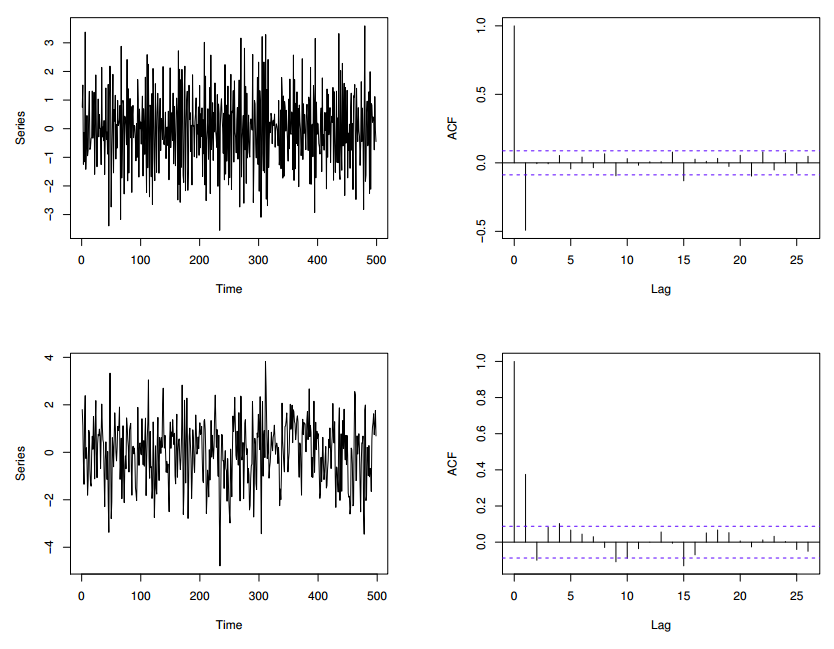

# Study Notes of Time Series

## Part 2: Some Linear Time Series models

### 2.1  $~$ Stochastic Processes and Their Property

**Stochastic Process** can be described as ‘a statistical phenomenon that evolves in time according to probabilistic laws’. a.k.a 'random process'.

Examples:

- length of a queue
- the number of accidents in a particular town in successive months
- the air temperature at a particular site on successive days

Mathematically, **Stochastic Process** is a collection of random variable that are ordered in time and defined at a set of time points, which may be continuous or discrete.

- denote $X(t)$ at time t if continuous ($-\infty <t < \infty$)
- denote $X_t$ at time t if discrete ($t = 0, \pm 1, \pm 2, .. $)

**IMPORTANT property of time series:** At most one observation at a given time.

This is not usually the case of all stochastic processces.

- **Ensemble:** the infinite set of time series that might have been observed.

- **Realization:** every member of the ensemble.

- The observed time series can be thought as one particular realization (and the **only** one that we will ever observe).

- Denote $x(t)$ if continuous, $x_t$ if descrete.

A useful way of describing a stochastic process is to give the *moments* of a process, particularly the first and second moments are called **mean** and **autocovariance funcition** (acv. f.)

These definition is analagous to the discrete case:

***Mean.***  $~~~$ The mean function $\mu(t)$ is defined for all $t$ by
$$ \mu(t) = E[X(t)]$$

***Variance.*** $~~~$ The variance function $\sigma^2(x)$ is defined for all $t$ by
$$\sigma^2(x) = Var[X(t)] = E[(X(t) - \mu(t))^2]$$

***Autocovariance.*** $~~~$ The acv.f. $\gamma(t_1, t_2)$ is the covariance of $X(t_1)$ with $X(t_2)$, i.e.

$$\gamma(t_1, t_2) = E\{ [X(t_1) - \mu(t_1)][X(t_2) - \mu(t_2)] \}$$

Note: Variance function is a special case of acv.f. when $t_1 = t_2$

### 2.2 $~$ Stationary Processes

***Definition.*** $~$ A time series is said to be **strictly stationary** if the joint distribution of $X(t_1), ..., X(t_k)$ is the same as the joint distribution of $X(t_1 + \tau), ..., X(t_k + \tau)$ for all $t_1, ..., t_k, \tau$

Notes:
- Shifting the time origin by an amount $\tau$ has no effect on the joint distributions, which must therefore depend only on the interval $t_1, t_2, .., t_k$.

- If $k=1$, the definition implies that the distribution of $X(t)$ is the same for all $t$. Provided the first two moments are finite, we have
$$ \mu(t) = \mu \\
\sigma^2(t) = \sigma^2$$

  are both constants

- If $k=2$, the joint distribution of $X(t_1)$ and $X(t_2)$ depends only on $t_2 - t_1 = \tau$, which is calledd the **lag**. Then $\gamma(t_1, t_2)$ can be written as $\gamma(\tau)$, and
$$ \begin{aligned} \gamma(\tau) &= E\{ [X(t) - \mu][X(t+\tau) - \mu] \} \\
                                &= Cov[X(t), X(t+\tau)] \end{aligned}$$

  is called the acv coefficient at lag $\tau$

***Definition.*** $~$ **Autocorrelation function** (ac.f.) is defined by

$$ \rho(\tau) = \gamma(\tau) / \gamma(0)$$

Note:
- The size of an $\gamma$ depends on the units in which $X(t)$ is measured. Thus ac.f. is helpful to standardize the acv.f.
- This quantity measures the correlation between $X(t)$ and $X(t+\tau)$.

***Definition.*** $~$ A process is **second-order stationary** (or **weakly stationary**) if its mean is constant and its acv.f. depends only the lag, so that
$$ E[X(t)] = \mu $$

and $$ Cov[X(t), X(t+\tau)] = \gamma(\tau) $$

Notes:

- By letting $\tau=0$, we note that the form of a stationary acv.f. implies that the variance, as well as the mean, is consant.
- The definition implies that both the variance and the mean must be finite.

The weaker definition of stationary will be used from now on.

### 2.3 $~$  Properties of the Autocorrelation Function

Suppose a stationary stochastic process $X(t)$ has mean $\mu$, variance $\sigma^2$, acv.f. $\gamma(\tau)$ and ac.f. $\rho(\tau)$. Then

$$ \rho(\tau) = \gamma(\tau) / \gamma(0) = \gamma(\tau) / \sigma^2$$

Note that $\rho(0) = 1$.

***Property 1:*** $~$ The ac.f. is an even function of the lag, so that $\rho(\tau) = \rho(-\tau)$.

*Proof.* $~$ $$ \begin{aligned}
\gamma(\tau) &= Cov[X(t), X(t+\tau)] \\
&= Cov[X(t - \tau), X(t) \ \ \ \ \ \ \text{Since $X(t)$ is stationary.} \\
&= \gamma(-\tau)
\end{aligned} $$

Notes:
- This property simply says that the correlation between $X(t)$ and $X(t+\tau)$ is the same as that between $X(t-\tau)$ and $X(t)$.

***Property 2:*** $~$ $| \rho(\tau) | \leq 1$

Notes:
- This indicates that the correlatiion coefficient is standardized acv.f., and the value of $\rho(\tau)$ does not depend on the units in which the time series is measured.

***Property 3:*** $~$ The ac.f. does not uniquely identify the underlying model.

Notes:
- We know that a given stochastic process has a unique covariance structure, but the converse is not in general true.
- We will see that, a requirement called the invertibility condition is needed to ensure uniquess in both directions.

### 2.4 $~$ Purely Random Processes

***Definition.*** $~$ A discrete-time process is called **a purely random proecess** (a.k.a **white noise**) if it consists of a sequence of random variables, $\{ Z_t\}$, which are mutually *independent and identically distributed* (i.i.d).

Note:

- Normally, further assume that they are normally distributed with mean 0 and variance $\sigma^2_Z$.
- The definitionn implies that the process has constant mean and variance.
- Independence assumption means
$$
\gamma(k) = Cov(Z_t, Z_{t+k}) = \begin{cases} \sigma^2_Z \ \ \ k=0 \\
0 \ \ \ \ \  k = \pm 1, \pm 2, ...
\end{cases} \tag{2.1}$$

  $$\Rightarrow \rho(k) = \begin{cases}1 \  \ \ \ \ k=0 \\
      0 \ \ \ \ \ k = \pm1, \pm 2, ...  \end{cases} \tag{2.2}$$

- Mean and acv.f. do not depend on time $\ \Rightarrow $ the process is second-order stationary
- independence assumption $\ \Rightarrow$ the process is also strictly stationary.

If all sample ac.f.'s of a series are close to zero (in the correlogram), then the series is considered as a purely random process

### 2.5 $~$ Random Walks

** for future updates **

### 2.6 $~$ Moving Average Processes

***Definition.*** $~$ Suppose that $\{Z_t\}$ is a purely random process with mean zero and variance $\sigma^2_Z$. Then a process $\{Z_t\}$ is said to be **a moving average process of order $q$** (MA(q) process) if

$$ X_t = \beta_0 Z_t + \beta_1 Z_{t-1} + ... + \beta_q Z_{t-q} \tag{2.3}$$

where $\{\beta_i \}$ are constants.

Note:

- The $Z$s are usually scaled so that $\beta_0 = 1$.
- An arbitrary constant, $\mu$, may be added to the right-hand side of (2.3) to give a process with mean $\mu$. This does not affect the ac.f.!

#### *2.6.1 $~$ Stationarity and autocorrelation funtion of an MA process*

Since $Z$s are independent, we have

$$ E(X_t) = 0, \\ Var(X_t) = \sigma^2_Z \sum_{i=0}^q \beta_i^2 $$

Try to calculate the ac.f. to interprete what correlogram looks like:

We have

$$ \begin{aligned}
\gamma &= Cov(X_t, \ X_{t+k}) \\
       &= Cov(\beta_0 Z_t + ... + \beta_q Z_{t-q}, \ \beta_0 Z_{t+k} + ... + \beta_q Z_{t+k-q}) \\
       &= \begin{cases} 0  &  k > q \\
                        \sigma^2_Z \sum_{i=0}^{q-k} \beta_i \beta_{i+k} & k = 0,1,...,q \\
                        \gamma(-k)  &  k<0
        \end{cases} \tag{2.4}
\end{aligned} $$

Since

$$Cov(Z_s, \ Z_t) = \begin{cases} \sigma_Z^2 & s=t \\
                                  0 & s\neq t \end{cases}$$

Note:

- $\gamma(k)$ does not depend on $t$, and the mean is constant $\Rightarrow$ the process is second order stationary for all values of the $\{\beta_i\}$
- if $Z$s are normally distributed, then so are the $X$s, and we have strictly stationary normal process.

Now, the ac.f. of the above MA($q$) process is given by

$$
\rho(k) = \begin{cases} 1 & k=0 \\
\sum_{i=0}^{q-k} \beta_i \beta_{i+k} / \sum_{i=0}^q \beta_i^2 & k =1,...,q \\
0 & k>q
\end{cases}
$$

Note:
- The ac.f. 'cuts off' at lag $q$, a special feature of MA Processes
- In particular, the MA(1) process with $\beta_0 = 1$ has ac.f. given by

$$
\rho(k) = \begin{cases} 1 & k=0 \\
\beta_1/(1+\beta_1^2) & k = \pm 1\\
0 & \text{otherwise.}
\end{cases}
$$

Examples of MA(1) and MA(2) are displayed below respectively.

#### *2.6.1 $~$ Intertibility of MA Processes*

*Property 3* in Section 2.3 says that we cannot identify a MA process uniquely from a given ac.f. But it is desirable to impose restrictions on the $\{\beta_i\}$ to ensure that the process satisfies a condition called **invertibility**. **It ensures that there is a unique invertible first-order MA process for a given ac.f.**

Consider the following first order MA precesses:

$$\begin{aligned}\text{A: $~~~~~~~~~~~$}  & X_t = X_t + \theta Z_{t-1} \\
\text{B: $~~~~~~~~~~~$} & X_t =  Z_t +\frac{1}{\theta} Z_{t-1} \end{aligned}$$

It can be easily shown that the two different process have the same $\rho(k)$. Thus we cannot identify an MA process uniquely from a given ac.f.

Now we 'invert' A and B: expressing $Z_t$ in terms of $X_t, X_{t-1}, ...$, we have (by successive substitution)

$$\begin{aligned}\text{A: $~~~~~~~~~~~$}  & Z_t = X_t - \theta X_{t-1} + \theta^2 X_{t-2} - ...\\
\text{B: $~~~~~~~~~~~$} & Z_t =  X_t -\frac{1}{\theta} X_{t-1} + \frac{1}{\theta^2} X_{t-2} - ...\end{aligned}$$

If $|\theta| <1$, the sereis of coefficients of $X_{t-j}$ for model A converges whereas that of B does not. Thus model B cannot be 'inverted' in this way.

***Definition.*** $~$ A process, $\{X_t\}$, is said to be **invertible** if the random disturbance at time $t$, sometimes caled the *innovation*, canbe expressed as a convergent sum of present and past values of $X_t$ in the form

$$ Z_t = \sum^\infty_{j=0} \pi_j X_{t-j}$$

where $\sum |\pi_j| < \infty$.

Note:

- This definition effectly means that the first-order MA process can be rewritten in the form of an autocoregressive process (possibly finite order) whose coefficient form a convergent sum.

### 2.7 $~$ Autoregressive Processes

***Definition.*** $~$ Suppose that $\{Z_t\}$ is a purely random process with mean zero and variance $\sigma^2_Z$. Then a process $\{X_t\}$ is said to be an **Autoregressive Process of order $p$** (AR($p$)) if

$$ X_t = \alpha_1 X_{t-1} + .. + \alpha_p X_{t-p} + Z_t \tag{2.5}$$

#### *3.7.1 $~$ First-order process*

First order process (a.k.a **Markov Process**): $p=1$, we have

$$X_t = \alpha X_{t-1} + Z_t \tag{2.6}$$

By successive substitution into Equation (2.6) we have

$$ \begin{aligned} X_t &= \alpha (\alpha X_{t-2} + Z_{t-1}) + Z_t \\
                       &= \alpha^2 (\alpha X_{t-3} + Z_{t-2}) + \alpha Z_{t-1} + Z_t
\end{aligned}$$

And eventually $X_t$ may be expressed as a infinite-order MA process in the form

$$X_t = Z_t + \alpha Z_{t-1} + \alpha Z_{t-2} + ...$$

proveded $-1 < \alpha < +1$ so that the sum converges.

It is clear that

$$ E(X_t) = 0 \\
Var(X_t) = \sigma^2_Z (1 + \alpha^2 + \alpha^4 + ...)$$

The variance is finite provided that $|\alpha|^2 < 1$. So if $|\alpha|<1$, we have

$$Var(X_t) = \sigma^2_X = \sigma^2_Z / (1-\alpha^2) $$

Now, the acv.f. is given by

$$\begin{aligned}
\gamma(k) &= E[X_t X_{t+k}]\\
          &= E[(\sum \alpha^i Z_{t-i})(\sum \alpha^j Z_{t+k-j})]\\
          &= \sigma^2_Z \sum^\infty_{i=0} \alpha^i \alpha^{k+i}  & \text{for } k>=0\\
          &= \alpha^k \sigma_Z^2 / (1-\alpha^2) & \text{provided } |\alpha| < 1 \\
          &= \alpha^k \sigma_X^2s
\end{aligned}$$

Since $\gamma(k)$ does not depend on $t$, an AR process of order 1 is second-order stationary provided that $|\alpha| < 1$, and ac.f. is given by

$$ \rho(k) = \alpha^k \ \ \ \ \ k=0, 1, 2,... $$

And to get an even function defined for all integer $k$, we can use

$$ \rho(k) = \alpha^{|k|} \ \ \ \ \ \ k = 0, \pm 1, \pm 2,...$$

Note: We can prove that
Second order stationary $\iff |\alpha| < 1$ . And strict inequality is important.

Below are three examples of the ac.f. of first-order AR process with $\alpha = 0.8, -0.8, 0.3$ respectively.

.png)

Note:

- The ac.f. decays quickly when $\alpha = 0.3$
- The ac.f. alternates when $\alpha = -0.8$
